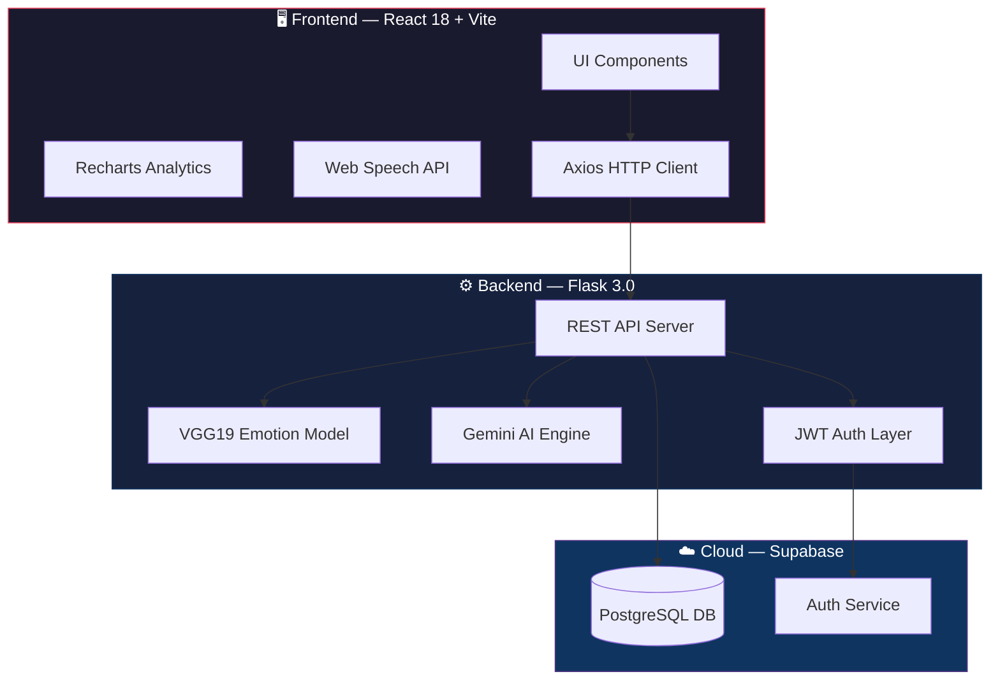

<div align="center">

# 🧠 MindPulse

### *Your AI-Powered Mental Health Companion*

<br/>

[](https://github.com/akashvoffi-design/Emotion-Based-Mental-Health-Monitoring-System)
[](LICENSE)
[](https://github.com/akashvoffi-design/Emotion-Based-Mental-Health-Monitoring-System/stargazers)
[](https://github.com/akashvoffi-design/Emotion-Based-Mental-Health-Monitoring-System/network)

<br/>


<br/>

**MindPulse** detects your facial emotions in real-time via webcam using a VGG19 deep learning model,  
tracks your mood over time with rich analytics, and provides a compassionate AI voice companion  
powered by **Google Gemini**.

<br/>

> ⚠️ **Disclaimer:** MindPulse is for **personal mood tracking only**. It is **NOT** a medical diagnostic tool and should not replace professional mental health care.

<br/>

[🚀 Get Started](#-quick-start) · [✨ Features](#-features-at-a-glance) · [🏗️ Architecture](#%EF%B8%8F-architecture) · [📡 API Reference](#-api-reference) · [🤝 Contributing](#-contributing)

</div>

---

<br/>

## ✨ Features at a Glance

<table>
<tr>
<td width="50%">

### 🎭 Facial Emotion Detection
Real-time webcam emotion recognition using a **fine-tuned VGG19** model trained on the **FER2013** dataset. Detects 7 core emotions with confidence scoring.

</td>
<td width="50%">

### 📊 Analytics Dashboard
Beautiful mood trend visualizations, **MHI score gauge**, emotion bar charts, and donut distribution charts — all powered by **Recharts**.

</td>
</tr>
<tr>
<td width="50%">

### 🎙️ AI Voice Companion
Hands-free voice conversations with **Google Gemini AI**. Speak naturally and receive empathetic, context-aware voice responses.

</td>
<td width="50%">

### 🧘 Breathing Room
Interactive guided breathing exercises (**4-7-8**, **Box**, **Deep**) with beautiful animated visuals + the **5-4-3-2-1 grounding** technique.

</td>
</tr>
<tr>
<td width="50%">

### 🎵 Ambient Soundscapes
Built-in **Web Audio API** synthesized ambient tones — Ocean, Focus, Forest, and Warmth — designed to promote calm and concentration.

</td>
<td width="50%">

### ✨ Emotion-Responsive UI
The entire UI subtly shifts its ambient glow to **match your detected emotional state**, creating a deeply personal experience.

</td>
</tr>
<tr>
<td width="50%">

### 🧠 AI Weekly Insights
**Gemini AI** analyzes your week's emotional data and generates a **personalized mental health digest** with actionable recommendations.

</td>
<td width="50%">

### 🏆 Wellness Streaks
Gamified streak tracking with growth visualization (**Seed → Sprout → Tree → Forest**), activity heatmap grid, and collectible badges.

</td>
</tr>
<tr>
<td width="50%">

### 📔 Mood Journal
Write reflective journal entries with **emotion tagging** and mood scoring. Track your inner thoughts alongside your detected emotions.

</td>
<td width="50%">

### 📡 Live Emotion Tracking
Continuous real-time webcam face detection and emotion stream with clean statistical side panels for instant feedback.

</td>
</tr>
</table>

### 🎯 Additional Highlights

| | Feature | Details |
|---|---|---|
| 🗂️ | **Emotion History** | 7 / 14 / 30-day history stored securely in Supabase |
| 🌙 | **Dark / Light Mode** | Fully themed UI with smooth CSS transitions |
| 🔐 | **JWT Authentication** | Secure login, signup, and protected routes |
| 📤 | **CSV Export** | Download your emotion data for external analysis |
| 🖥️ | **Smart Navigation** | Collapsible sidebar, seamless UX, confirmation modals |

---

<br/>

## 🏗️ Architecture



---

<br/>

## 🛠️ Tech Stack

<details>
<summary><strong>🎨 Frontend</strong></summary>
<br/>

| Technology | Purpose |
|:---|:---|
| [React 18](https://react.dev/) + [Vite 5](https://vitejs.dev/) | UI framework & lightning-fast build tool |
| [Tailwind CSS](https://tailwindcss.com/) | Utility-first responsive styling |
| [Lucide React](https://lucide.dev/) | Beautiful, consistent icon library |
| [Recharts](https://recharts.org/) | Composable analytics chart components |
| [React Router v6](https://reactrouter.com/) | Declarative client-side routing |
| [Axios](https://axios-http.com/) | Promise-based HTTP client with interceptors |
| Web Speech API | Browser-native voice recognition & synthesis |

</details>

<details>
<summary><strong>⚙️ Backend</strong></summary>
<br/>

| Technology | Purpose |
|:---|:---|
| [Python 3.10+](https://python.org) | Runtime environment |
| [Flask 3.0](https://flask.palletsprojects.com/) | Lightweight REST API framework |
| [Flask-JWT-Extended](https://flask-jwt-extended.readthedocs.io/) | Secure JWT authentication tokens |
| [Flask-CORS](https://flask-cors.readthedocs.io/) | Cross-origin resource sharing |
| [TensorFlow / Keras 2.15+](https://tensorflow.org) | VGG19 deep learning model inference |
| [OpenCV](https://opencv.org/) | Real-time face detection & image processing |
| [Google Generative AI](https://ai.google.dev/) | Gemini AI for voice companion & insights |
| [Supabase SDK](https://supabase.com/docs/reference/python) | Database & auth client |
| [Gunicorn](https://gunicorn.org/) | Production-grade WSGI server |

</details>

<details>
<summary><strong>☁️ Database & Cloud</strong></summary>
<br/>

| Service | Purpose |
|:---|:---|
| [Supabase](https://supabase.com) | Managed PostgreSQL + Auth + Storage |

</details>

---

<br/>

## 📁 Project Structure

```
📦 project/
├── 🔧 backend/
│   ├── 🤖 ai_model/
│   │   ├── emotion_vgg19.h5            # VGG19 trained model weights
│   │   └── model.yaml                  # Model architecture config
│   ├── app.py                          # 🚀 Main Flask API server
│   ├── requirements.txt                # Python dependencies
│   ├── Procfile                        # Gunicorn production entry
│   └── runtime.txt                     # Python version pin
│
├── 🎨 frontend/
│   ├── public/
│   ├── src/
│   │   ├── 🧩 components/
│   │   │   ├── Navbar.jsx              # Collapsible left sidebar
│   │   │   ├── EmotionDetector.jsx     # Webcam + emotion capture
│   │   │   ├── EmotionResult.jsx       # Emotion result display
│   │   │   ├── AmbientSoundPlayer.jsx  # Ambient sound engine
│   │   │   ├── Chart.jsx              # Recharts wrappers
│   │   │   ├── JournalEntry.jsx       # Journal card component
│   │   │   ├── ThemeToggle.jsx        # Dark/light mode switcher
│   │   │   └── WellnessSuggestion.jsx # Wellness tip cards
│   │   │
│   │   ├── 🌐 context/
│   │   │   ├── AuthContext.jsx         # Global auth state
│   │   │   ├── ThemeContext.jsx        # Global theme state
│   │   │   └── EmotionAmbientContext.jsx  # Emotion-responsive glow
│   │   │
│   │   ├── 📄 pages/
│   │   │   ├── Dashboard.jsx           # Main dashboard
│   │   │   ├── Analytics.jsx           # Charts & insights
│   │   │   ├── Journal.jsx             # Mood journal
│   │   │   ├── LiveTracking.jsx        # Real-time tracking
│   │   │   ├── VoiceAgent.jsx          # AI voice companion
│   │   │   ├── BreathingRoom.jsx       # Breathing exercises
│   │   │   ├── WeeklyInsights.jsx      # AI weekly report
│   │   │   ├── Streaks.jsx             # Gamification
│   │   │   ├── Settings.jsx            # User settings
│   │   │   ├── Login.jsx               # Login page
│   │   │   └── Signup.jsx              # Signup page
│   │   │
│   │   ├── 🔌 services/
│   │   │   └── api.js                  # Axios instance + interceptors
│   │   ├── App.jsx                     # Root component
│   │   ├── main.jsx                    # Entry point
│   │   └── index.css                   # Global styles + tokens
│   │
│   ├── package.json
│   ├── tailwind.config.js
│   └── vite.config.js
│
├── 📓 facial-emotion-recognition-vgg19-fer2013.ipynb
├── 📄 README.md
├── 📄 LICENSE
└── 📄 .gitignore
```

---

<br/>

## 🚀 Quick Start

### Prerequisites

| Requirement | Minimum Version |
|:---|:---|
| Node.js | `18+` |
| Python | `3.10+` |
| npm | `9+` |

You'll also need free accounts on:
- 🟢 [**Supabase**](https://supabase.com) — for database & authentication
- 🔵 [**Google AI Studio**](https://aistudio.google.com/) — for Gemini API key

---

<details>
<summary><h3>📋 Step 1 — Database Setup (Supabase)</h3></summary>
<br/>

1. Create a free project at [supabase.com](https://supabase.com)
2. Open the **SQL Editor** and run the following schema:

```sql
-- 👤 Users table
CREATE TABLE public.users (
  id         UUID PRIMARY KEY REFERENCES auth.users(id),
  name       TEXT,
  email      TEXT UNIQUE NOT NULL,
  created_at TIMESTAMPTZ DEFAULT now()
);

-- 🎭 Emotions table
CREATE TABLE public.emotions (
  id         UUID PRIMARY KEY DEFAULT gen_random_uuid(),
  user_id    UUID REFERENCES public.users(id) ON DELETE CASCADE,
  emotion    TEXT NOT NULL,
  confidence FLOAT,
  timestamp  TIMESTAMPTZ DEFAULT now()
);

-- 📔 Journal entries table
CREATE TABLE public.journal_entries (
  id         UUID PRIMARY KEY DEFAULT gen_random_uuid(),
  user_id    UUID REFERENCES public.users(id) ON DELETE CASCADE,
  title      TEXT,
  content    TEXT NOT NULL,
  emotion    TEXT,
  mood_score INT,
  created_at TIMESTAMPTZ DEFAULT now()
);
```

3. Navigate to **Project Settings → API** and copy:
   - `Project URL`
   - `anon / public` key

</details>

---

<details>
<summary><h3>🤖 Step 2 — AI Model Setup</h3></summary>
<br/>

1. Visit the [Kaggle model page](https://www.kaggle.com/code/enesztrk/facial-emotion-recognition-vgg19-fer2013)
2. Download `emotion_vgg19.h5`
3. Place it at:

```
backend/ai_model/emotion_vgg19.h5
```

> **💡 Tip:** If the model file is missing, the backend automatically falls back to **simulated emotion data** so you can still test the UI without downloading the model.

</details>

---

<details>
<summary><h3>🔑 Step 3 — Environment Variables</h3></summary>
<br/>

Create the following `.env` files:

**`backend/.env`**
```env
SUPABASE_URL=https://your-project.supabase.co
SUPABASE_ANON_KEY=your-supabase-anon-key
JWT_SECRET_KEY=your-random-secret-key-here
GEMINI_API_KEY=your-google-gemini-api-key
```

**`frontend/.env.local`**
```env
VITE_API_URL=http://localhost:5000
VITE_SUPABASE_URL=https://your-project.supabase.co
VITE_SUPABASE_ANON_KEY=your-supabase-anon-key
```

> ⚠️ **Never commit your `.env` files!** They are already included in `.gitignore`.

</details>

---

<details>
<summary><h3>⚙️ Step 4 — Run the Backend</h3></summary>
<br/>

```bash
cd backend

# Create & activate virtual environment
python -m venv venv
venv\Scripts\activate          # Windows
# source venv/bin/activate     # macOS / Linux

# Install dependencies
pip install -r requirements.txt

# 🚀 Start the server
python app.py
```

✅ Backend runs at → **`http://localhost:5000`**

</details>

---

<details>
<summary><h3>🎨 Step 5 — Run the Frontend</h3></summary>
<br/>

```bash
cd frontend

# Install dependencies
npm install

# 🚀 Start dev server
npm run dev
```

✅ Frontend runs at → **`http://localhost:5173`**

</details>

---

<br/>

## 📡 API Reference

<details>
<summary><strong>🔐 Authentication</strong></summary>
<br/>

| Method | Endpoint | Description |
|:---|:---|:---|
| `POST` | `/api/auth/signup` | Register a new user |
| `POST` | `/api/auth/login` | Login and receive JWT token |

</details>

<details>
<summary><strong>🎭 Emotion Detection</strong></summary>
<br/>

| Method | Endpoint | Auth | Description |
|:---|:---|:---:|:---|
| `POST` | `/api/emotion/detect` | 🔒 | Detect emotion from uploaded image |
| `POST` | `/api/emotion/detect_live` | 🔒 | Detect emotion from live webcam frame |
| `GET` | `/api/emotion/history` | 🔒 | Get emotion history (`?days=7`) |
| `GET` | `/api/emotion/analytics` | 🔒 | Get analytics summary (`?days=7`) |

</details>

<details>
<summary><strong>🎙️ Voice Agent</strong></summary>
<br/>

| Method | Endpoint | Auth | Description |
|:---|:---|:---:|:---|
| `POST` | `/api/voice_agent` | 🔒 | Send message, receive Gemini AI reply |

</details>

<details>
<summary><strong>🧠 Weekly Insights</strong></summary>
<br/>

| Method | Endpoint | Auth | Description |
|:---|:---|:---:|:---|
| `POST` | `/api/weekly_insights` | 🔒 | Generate AI-powered weekly mental health digest |

</details>

---

<br/>

## 🧬 Emotion Labels & Scoring

The VGG19 model classifies facial expressions into **7 core emotions**:

<div align="center">

| Emotion | Label | Score | Impact |
|:---:|:---|:---:|:---|
| 😊 | **Happy** | `+2` | 🟢 Positive |
| 😮 | **Surprise** | `+1` | 🔵 Neutral / Positive |
| 😐 | **Neutral** | `0` | ⚪ Neutral |
| 😠 | **Angry** | `-1` | 🟠 Negative |
| 🤢 | **Disgust** | `-1` | 🟠 Negative |
| 😨 | **Fear** | `-1` | 🟠 Negative |
| 😢 | **Sad** | `-2` | 🔴 Most Negative |

</div>

### 📈 Mental Health Index (MHI) Formula

```
MHI = ((average_emotion_score + 2) / 4) × 100
```

> The result is clamped to a **0 – 100** scale, where **100** represents optimal emotional well-being.

---

<br/>

## 🔒 Security & Privacy

<table>
<tr>
<td>🔑</td>
<td><strong>Password Security</strong></td>
<td>Handled entirely by <strong>Supabase Auth</strong> — bcrypt hashed, never stored raw</td>
</tr>
<tr>
<td>📷</td>
<td><strong>No Image Storage</strong></td>
<td>Only the <strong>emotion label</strong> and <strong>confidence score</strong> are stored — no facial images</td>
</tr>
<tr>
<td>🔐</td>
<td><strong>Data Isolation</strong></td>
<td>All data is user-isolated via <code>user_id</code> foreign keys</td>
</tr>
<tr>
<td>⏱️</td>
<td><strong>Token Expiry</strong></td>
<td>JWT tokens expire automatically and are cleared on logout</td>
</tr>
<tr>
<td>🚫</td>
<td><strong>Secret Management</strong></td>
<td><code>.env</code> files are gitignored — never commit your API keys</td>
</tr>
</table>

---

<br/>

## 📦 Deployment

<table>
<tr>
<th width="50%">⚙️ Backend (Render / Railway)</th>
<th width="50%">🎨 Frontend (Vercel / Netlify)</th>
</tr>
<tr>
<td>

- Use `Procfile`: `web: gunicorn app:app`
- Set all env vars in the platform dashboard
- Python version pinned in `runtime.txt`

</td>
<td>

- **Build command:** `npm run build`
- **Output directory:** `dist`
- Set `VITE_API_URL` to your deployed backend

</td>
</tr>
</table>

---

<br/>

## 🤝 Contributing

Contributions are what make the open source community amazing! Any contributions you make are **greatly appreciated**.

```
1. Fork the repository
2. Create your feature branch     →  git checkout -b feature/amazing-feature
3. Commit your changes            →  git commit -m 'Add amazing feature'
4. Push to the branch             →  git push origin feature/amazing-feature
5. Open a Pull Request
```

---

<br/>

## 📜 License

Distributed under the **MIT License**. See [`LICENSE`](LICENSE) for more information.

---

<br/>

<div align="center">

## 👤 Author

**Akash** · [@akashvoffi-design](https://github.com/akashvoffi-design)

<br/>

---

<br/>

**Built with ❤️ as part of the MLFED (Machine Learning Frontend & Emotion Detection) project.**

<br/>

⭐ **If you found this project useful, consider giving it a star!** ⭐

<br/>

</div>
